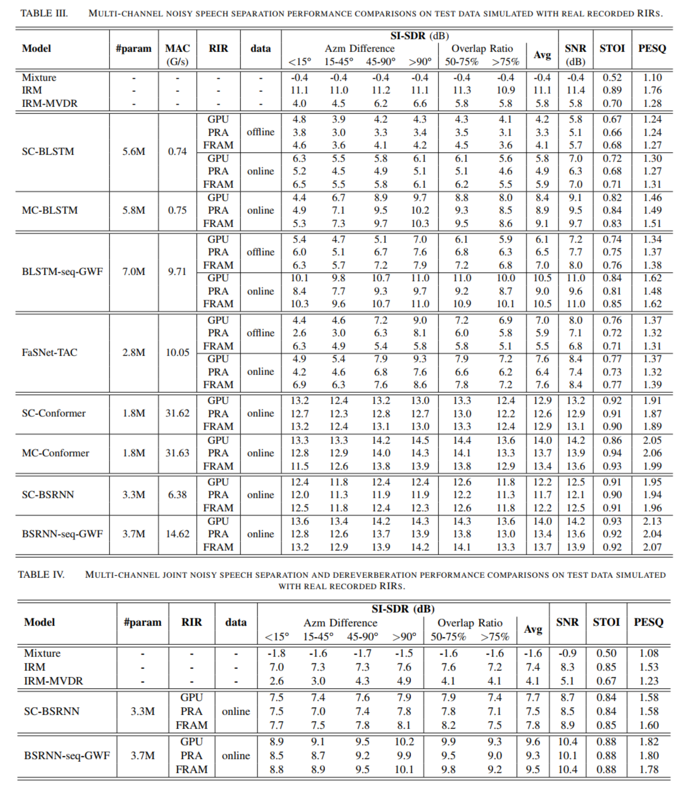

# Fast Random Approximation of Multi-channel Room Response Impulse (FRAM-RIR)

This is the repository for a Pytorch-based implementation of Fast Random Approximation of Multi-channel Room Response Impulse (FRAM-RIR) method for data augmentation purpurse in simulating spatialized reverberant signals. FRAM-RIR is a image-source method (ISM) based RIR simulation method that bypasses the explicit calculation of sound propagation paths in ISM-based algorithms by randomly sampling the location and number of reflections of each virtual sound source based on several heuristic assumptions, while still maintains accurate direction-of-arrival (DOA) information of all sound sources.
FRAM-RIR can not only simulate RIR filters that better mimic the patterns of real RIR filters than existing tools, but is also significantly faster than other CPU-based methods with a single thread and faster than GPU-accelerated methods with multi-threading.

## Disclaimer
This is not an officially supported Tencent product.
